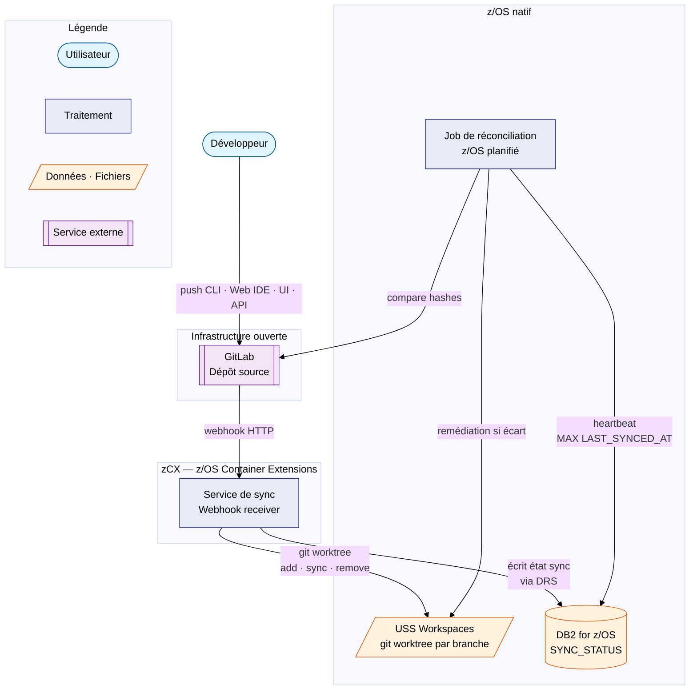

# Résilience et synchronisation USS

!!! warning "En cours de spécification"
    Cette page décrit l'architecture de résilience prévue. Le service de synchronisation n'est pas encore implémenté — cette conception guide les développements à venir.

!!! info "Prérequis"
    Cette page suppose une familiarité de base avec Git (branche, commit, hash) et avec le concept de *package* (unité de livraison versionnée). Elle s'appuie aussi sur le rôle de DB2 for z/OS, la base de données utilisée pour la traçabilité de la plateforme.

## La contrainte de départ

La plateforme repose sur GitLab, une infrastructure ouverte hébergée hors du z/OS. Sur un SI (*Système d'Information*) critique bancaire, toute dépendance à une infrastructure externe représente un risque réglementaire : une panne GitLab ne peut pas priver le périmètre z/OS natif de l'accès aux sources.

**La règle est donc absolue : à tout instant, les sources sur USS (*Unix System Services*) sont identiques aux sources sur GitLab.**

USS n'est pas un cache de travail. C'est un **miroir réglementaire** : une copie certifiable et vérifiable du référentiel GitLab, hébergée dans le périmètre z/OS natif.

**USS est strictement accessible en lecture pour tout le monde, y compris en mode dégradé.** Seul le service de synchronisation est autorisé à écrire sur les workspaces USS (création, mise à jour, suppression de worktrees) ; aucun développeur, opérateur ou processus manuel n'y écrit directement, sous peine de rompre la garantie d'identité avec GitLab que ce miroir existe pour certifier.

## Les workspaces USS — une branche, un répertoire

Le patrimoine applicatif compte environ **600 dépôts**, un par application du SI, chacun référencé dans la cartographie d'entreprise **CAPIREF** sous un code application unique sur deux caractères alphanumériques, préfixé `DA` (développement propriétaire LCL) ou `DY` (progiciel) — par exemple `DA12` ou `DY07`. Le mécanisme décrit ci-dessous se répète à l'identique pour chacun de ces 600 dépôts, indépendamment les uns des autres.

Pour un dépôt donné, USS ne maintient pas une seule copie de `main`. Chaque branche active dispose de son propre répertoire de travail, créé dès la création de la branche dans GitLab.

La solution technique retenue est **`git worktree`** : plusieurs branches coexistent simultanément sur USS depuis un seul dépôt git, en partageant les objets git communs. Seuls les fichiers propres à chaque branche occupent de l'espace supplémentaire.

```
/u/gitlab/
  DA12/                               ← application DA12 (code CAPIREF)
    repo/                             ← dépôt git principal (objets partagés)
    workspaces/
      main/                           ← branche main (référence)
      pkg-PKG-20260616-0042/          ← workspace du package 0042
      pkg-PKG-20260617-0001/          ← workspace du package 0001
  DY07/                               ← application DY07 (autre code CAPIREF)
    repo/
    workspaces/
      main/
      pkg-PKG-20260617-0003/          ← workspace du package 0003
```

Quand un développeur ne modifie que 3 fichiers sur sa branche, son workspace ne coûte que ces 3 fichiers en espace disque par rapport à `main` — le reste est partagé.

## Le service de synchronisation

La synchronisation est **découplée du pipeline de build**. Un pipeline peut être annulé, échouer ou être manuellement skippé — la sync USS doit se produire quoi qu'il arrive.

Le service de sync est un composant dédié qui tourne dans un container **zCX** (*z/OS Container Extensions* — la technologie qui permet de faire tourner des containers Linux sur z/OS) et réagit aux **webhooks GitLab** : des notifications HTTP que GitLab envoie sur chaque événement de dépôt, indépendamment de tout pipeline.

!!! info "Le webhook se déclenche quel que soit le canal utilisé par le développeur"
    Le webhook est émis **côté serveur GitLab**, sur l'événement de dépôt lui-même (un nouveau commit existe, une branche est créée ou supprimée) — pas sur le client qui a produit cet événement. Le résultat est donc identique que le développeur :

    - pousse en CLI via `git push` depuis son poste ou un accès distant (VPN, bastion) ;
    - commite directement depuis l'interface web de GitLab (Web IDE, édition de fichier en ligne) ;
    - crée ou supprime une branche depuis l'interface graphique GitLab ;
    - déclenche l'action via l'API REST GitLab.

    Dans tous ces cas, GitLab produit le même événement serveur (`push`, `create`, `delete`) et émet le même webhook vers le service de sync. La résilience décrite dans cette page (relances automatiques, heartbeat DB2, réconciliation périodique) s'applique donc indépendamment du canal d'accès au dépôt.

!!! info "Comment GitLab détecte qu'un webhook a échoué"
    GitLab ne sonde pas activement la disponibilité du service de sync : il le découvre **au moment où il essaie réellement de livrer un événement**. Le service doit répondre par un code HTTP **2xx** dans un délai limité (~10 secondes) ; tout code 4xx/5xx, time-out ou refus de connexion est considéré comme un échec et déclenche le calendrier de relance (1 min, 5 min, 10 min, 100 min, 100 min). Chaque tentative — code retour inclus — est consultable dans GitLab via *Settings → Webhooks → Edit → Recent Deliveries*, avec un bouton "Resend" pour rejouer manuellement.

    C'est donc un mécanisme de détection **par événement**, pas un heartbeat continu : si aucune branche n'est touchée pendant la panne, GitLab ne "voit" pas le service de sync indisponible. C'est le rôle du **heartbeat DB2** (ci-dessous) de combler ce trou en quasi temps réel, sans attendre un événement GitLab ni un job planifié.

### Heartbeat DB2 — détection quasi temps réel

Le service de sync écrit chaque opération dans une table **DB2 for z/OS**, via **DRS** (*Db2 REST Services* — le composant IBM qui expose les stored procedures DB2 comme endpoints REST, déjà utilisé par le reste de la plateforme), en plus du journal USS. C'est une extension du registre central déjà utilisé pour la traçabilité des packages — aucune nouvelle brique d'infrastructure, juste une table de plus et un appel DRS de plus par webhook traité.

Cet appel zCX → DRS s'authentifie avec un **compte technique** dédié, via **PassTicket** RACF : le secret n'est jamais stocké en clair côté zCX, puisque le PassTicket est à usage unique et généré à la demande à partir d'un secret partagé déjà connu de RACF et de DRS. Cette partie de la chaîne de sécurité — strictement interne au périmètre z/OS — est donc couverte. Ce qui reste à trancher (authentification du webhook entrant depuis GitLab, et rotation du jeton d'API GitLab utilisé par la réconciliation) est suivi dans [Points non couverts](../points-ouverts.md#securisation-des-echanges-avec-gitlab).

```sql
-- Table SYNC_STATUS (une ligne par branche par application, mise à jour
-- à chaque webhook traité). APP_CODE seul ne suffit pas comme clé : chacune
-- des ~600 applications (DAxx/DYxx) possède sa propre branche "main", donc
-- BRANCH_NAME seul entrerait en collision entre applications.
CREATE TABLE SYNC_STATUS (
    APP_CODE        CHAR(4)      NOT NULL,  -- code CAPIREF, ex. 'DA12'
    BRANCH_NAME     VARCHAR(255) NOT NULL,
    LAST_EVENT_TYPE VARCHAR(10),   -- 'CREATE' · 'PUSH' · 'DELETE'
    COMMIT_HASH     VARCHAR(40),
    LAST_SYNCED_AT  TIMESTAMP NOT NULL,
    PRIMARY KEY (APP_CODE, BRANCH_NAME)
);
```

Chaque écriture dans `SYNC_STATUS` met à jour un horodatage global (`MAX(LAST_SYNCED_AT)` sur l'ensemble des applications et de leurs branches). Tant que le service de sync traite des événements, cet horodatage avance.

S'il **n'avance plus** au-delà d'un seuil (ex. 15 minutes sans aucune écriture, alors qu'une activité est normalement attendue en continu sur le patrimoine des 600 applications), c'est le signe que le service de sync est indisponible — sans attendre ni un événement GitLab supplémentaire, ni la prochaine exécution d'un job planifié. Une requête DB2 simple, branchée sur la supervision déjà en place, suffit :

```sql
SELECT CASE WHEN MAX(LAST_SYNCED_AT) < CURRENT TIMESTAMP - 15 MINUTES
            THEN 'ALERTE — service de sync probablement down'
            ELSE 'OK' END
FROM SYNC_STATUS;
```

Ce heartbeat ne remplace pas la comparaison avec l'état réel de GitLab — il ne sait que ce que le service de sync a lui-même traité, pas ce qui a pu être **perdu côté GitLab** au-delà des relances. C'est pour cette vérification de fond que la réconciliation périodique reste nécessaire, mais à une cadence plus légère puisque le cas le plus urgent — le service est-il en vie ? — est désormais couvert en continu, sans job dédié.



Ce diagramme se lit de gauche à droite : le développeur agit sur GitLab (quel que soit le canal), GitLab notifie le service de sync par webhook, qui met à jour à la fois USS (les sources) et DB2 (l'état de la synchro) ; le job de réconciliation, lui, vérifie périodiquement la cohérence entre ces trois éléments.

### Cycle de vie d'une branche

Un nom de branche GitLab peut contenir des `/` — quelle que soit la convention de nommage utilisée par l'équipe (`pkg/PKG-20260616-0042`, `DAY1000001/features-demo`, etc.). Or chaque workspace USS est un répertoire **à plat** : un `/` y serait interprété comme un séparateur de chemin et créerait des sous-répertoires non désirés plutôt qu'un seul workspace.

Le service de sync convertit donc systématiquement **chaque `/` du nom de branche en `-`** pour construire le nom du répertoire workspace, quel que soit le nombre ou la position de ces `/` :

- `pkg/PKG-20260616-0042` (application `DA12`) → `/u/gitlab/DA12/workspaces/pkg-PKG-20260616-0042`
- `DAY1000001/features-demo` (application `DY07`) → `/u/gitlab/DY07/workspaces/DAY1000001-features-demo`

Une fois cette conversion appliquée, le service de sync réagit à trois types d'événements GitLab :

| Événement GitLab | Action USS |
|---|---|
| Création de branche `pkg/...` | `git worktree add /u/gitlab/<app>/workspaces/<branche-converti> <branche>` |
| Push (commit) sur la branche | `git -C /u/gitlab/<app>/workspaces/<branche-converti> fetch && git -C /u/gitlab/<app>/workspaces/<branche-converti> reset --hard origin/<branche>` |
| Suppression de branche (après merge) | `git worktree remove /u/gitlab/<app>/workspaces/<branche-converti>` |

!!! info "Amorçage initial et idempotence"
    Au premier démarrage du service (ou après une réinstallation), tous les workspaces des 600 dépôts doivent être créés en bloc avant que le flux normal de webhooks ne s'applique. Pendant cette fenêtre, un webhook de push peut arriver sur une branche dont le workspace n'a pas encore été créé par l'amorçage. Ce cas n'est pas traité comme une erreur : un push sur un workspace inexistant est exécuté comme un **create + push idempotent** (`git worktree add` suivi du `reset --hard` sur le commit indiqué), ce qui couvre l'amorçage initial sans logique dédiée supplémentaire.

Chaque opération est **horodatée et journalisée** avec le hash de commit correspondant. Ce journal constitue la preuve d'audit : à chaque instant, on peut établir quel commit était présent sur USS et à quelle heure.

### Réconciliation périodique

Le webhook garantit la sync en temps réel, et le heartbeat DB2 détecte une panne du service en quelques minutes — mais ni l'un ni l'autre ne sait si un événement a été **perdu côté GitLab** au-delà des relances. Un **job z/OS planifié** exécute la même logique que la [resynchronisation complète](gestion-incidents.md#resynchronisation-complete) décrite dans la page dédiée à la gestion des incidents : il part de la liste des branches GitLab (source de vérité, récupérée en mode paginé) et la confronte à l'état connu en DB2 (et, ponctuellement, à l'état réel des workspaces USS).

Ce balayage couvre les **quatre cas** possibles, pas seulement le retard de commits :

- branche GitLab sans workspace USS correspondant (ex. webhook de création perdu) ;
- workspace USS en retard sur GitLab (ex. webhook de push perdu) ;
- workspace USS à jour (aucune action) ;
- workspace USS orphelin, dont la branche GitLab a été supprimée (ex. webhook de suppression perdu).

Sa cadence peut désormais être **plus légère qu'auparavant** (ex. une fois par jour plutôt que toutes les heures) : le cas le plus urgent — le service de sync est-il en vie ? — est déjà couvert en continu par le heartbeat DB2. Ce job ne reste nécessaire que pour le cas résiduel, plus rare, d'un événement réellement perdu côté GitLab malgré un service de sync disponible.

En cas de divergence, le job journalise l'écart, déclenche une alerte vers l'équipe d'exploitation (canal de supervision z/OS existant) et lance automatiquement la resynchronisation complète sur les branches concernées — sans attendre d'intervention manuelle.

## Impact sur l'architecture globale

Ce composant modifie la vue d'ensemble de la plateforme sur quatre points :

1. **Un nouveau container zCX** est ajouté : le service de sync, dédié à la réception des webhooks et à la gestion des worktrees USS. Il est intentionnellement séparé du container applicatif (NiceGUI + FastAPI) pour que sa panne n'affecte pas l'interface, et réciproquement.

2. **USS devient une couche d'infrastructure à part entière**, et non un simple répertoire de travail temporaire. Sa disponibilité, son espace disque et la santé de ses worktrees doivent être surveillées au même titre que les autres composants critiques de la plateforme.

3. **DB2 for z/OS gagne une table supplémentaire** (`SYNC_STATUS`), sans nouvelle brique d'infrastructure : c'est une extension du registre central déjà utilisé pour la traçabilité des packages. Elle porte le heartbeat de disponibilité du service de sync et accélère la réconciliation périodique.

4. **La résilience de ce composant s'appuie sur l'infrastructure existante** : le SI bancaire est hébergé sur deux datacenters en haute disponibilité, ce qui couvre nativement la panne physique (stockage, LPAR) ainsi que la disponibilité de DB2 — sans dispositif spécifique à concevoir pour ce projet sur ce point. Seule la topologie du service de sync lui-même entre les deux sites (actif/actif ou actif/passif) reste à préciser, voir [Points non couverts](../points-ouverts.md#topologie-du-service-de-sync-entre-les-deux-datacenters).

USS étant maintenu à l'identique de GitLab par ce mécanisme, c'est cette garantie qui permet un **mode dégradé** en cas de panne GitLab : compiler, promouvoir et déployer directement depuis le dernier état synchronisé.

---

Pour la suite opérationnelle — que se passe-t-il pendant une panne, comment vérifier que USS est à jour, comment resynchroniser après incident — voir [Gestion des incidents et reprise](gestion-incidents.md).

Pour le contexte stratégique plus large — comment ce miroir pourrait servir d'autres projets et obligations réglementaires — voir [Perspectives et synergies](../perspectives.md).
