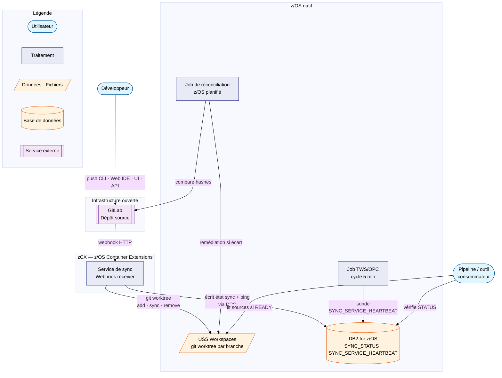
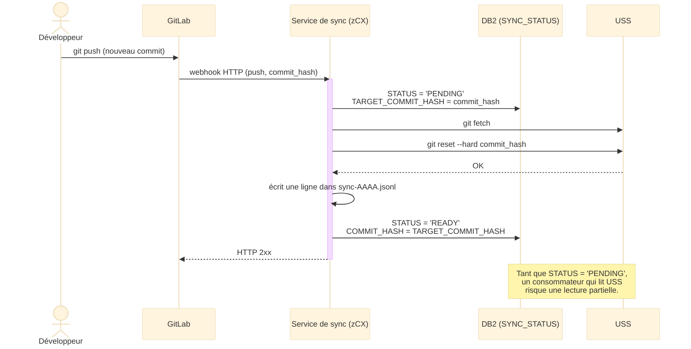

# Le service de synchronisation

!!! info "Prérequis"
    Cette page suppose une connaissance de [La contrainte de départ et les workspaces USS](index.md).

La synchronisation est **découplée du pipeline de build**. Un pipeline peut être annulé, échouer ou être manuellement ignoré — la sync USS doit se produire quoi qu'il arrive.

Le service de sync est un composant dédié qui tourne dans un container **zCX** (*z/OS Container Extensions* — la technologie qui permet de faire tourner des containers Linux sur z/OS) et réagit aux **webhooks GitLab** : des notifications HTTP que GitLab envoie sur chaque événement de dépôt, indépendamment de tout pipeline.

!!! info "Le webhook se déclenche quel que soit le canal utilisé par le développeur"
    Le webhook est émis **côté serveur GitLab**, sur l'événement de dépôt lui-même (un nouveau commit existe, une branche est créée ou supprimée) — pas sur le client qui a produit cet événement. Le résultat est donc identique que le développeur :

    - pousse en CLI via `git push` depuis son poste ou un accès distant (VPN, bastion) ;
    - commite directement depuis l'interface web de GitLab (Web IDE, édition de fichier en ligne) ;
    - crée ou supprime une branche depuis l'interface graphique GitLab ;
    - déclenche l'action via l'API REST GitLab.

    Dans tous ces cas, GitLab produit le même événement serveur (`push`, `create`, `delete`) et émet le même webhook vers le service de sync. La résilience décrite dans cette section (relances automatiques, heartbeat DB2, réconciliation périodique) s'applique donc indépendamment du canal d'accès au dépôt.

!!! info "Comment GitLab détecte qu'un webhook a échoué"
    GitLab ne sonde pas activement la disponibilité du service de sync : il le découvre **au moment où il essaie réellement de livrer un événement**. Le service doit répondre par un code HTTP **2xx** dans un délai limité (~10 secondes) ; tout code 4xx/5xx, time-out ou refus de connexion est considéré comme un échec et déclenche le calendrier de relance (1 min, 5 min, 10 min, 100 min, 100 min). Chaque tentative — code retour inclus — est consultable dans GitLab via *Settings → Webhooks → Edit → Recent Deliveries*, avec un bouton `Resend` pour rejouer manuellement.

    C'est donc un mécanisme de détection **par événement**, pas un heartbeat continu : si aucune branche n'est touchée pendant la panne, GitLab ne "voit" pas le service de sync indisponible. C'est le rôle du **heartbeat DB2** (voir [Détection et gestion des défauts de synchro](detection-defauts.md)) de combler ce trou en quasi temps réel, sans attendre un événement GitLab ni un job planifié.

## Vue d'ensemble

Le schéma suivant résume les acteurs et échanges du mécanisme :



Ce diagramme se lit de gauche à droite : le développeur agit sur GitLab (quel que soit le canal), GitLab notifie le service de sync par webhook, qui met à jour à la fois USS (les sources) et DB2 (l'état de la synchro, plus son propre signal de vie) via **DRS** (*Db2 REST Services* — l'interface qui expose DB2 sous forme d'appels API REST) ; un job **TWS/OPC** (*Tivoli Workload Scheduler* — l'ordonnanceur de traitements batch du Mainframe) sonde ce signal de vie toutes les 5 minutes, indépendamment de toute activité ; le job de réconciliation vérifie périodiquement la cohérence entre GitLab, DB2 et USS ; un consommateur (pipeline, outil de packaging) vérifie le statut en DB2 avant de lire les sources sur USS — voir [Détection et gestion des défauts de synchro](detection-defauts.md).

## Cycle de vie d'une branche

Un nom de branche GitLab peut contenir des `/` — quelle que soit la convention de nommage utilisée par l'équipe (`pkg/PKG-20260616-0042`, `DAY1000001/features-demo`, etc.). Or chaque workspace USS est un répertoire **à plat** : un `/` y serait interprété comme un séparateur de chemin et créerait des sous-répertoires non désirés plutôt qu'un seul workspace.

Le service de sync convertit donc systématiquement **chaque `/` du nom de branche en `-`** pour construire le nom du répertoire workspace, quel que soit le nombre ou la position de ces `/` :

- `pkg/PKG-20260616-0042` (application `DA12`) → `/u/gitlab/DA12/workspaces/pkg-PKG-20260616-0042`
- `DAY1000001/features-demo` (application `DY07`) → `/u/gitlab/DY07/workspaces/DAY1000001-features-demo`

Une fois cette conversion appliquée, le service de sync réagit à trois types d'événements GitLab :

| Événement GitLab | Action USS |
|---|---|
| Création de branche `pkg/...` | `git worktree add /u/gitlab/<app>/workspaces/<branche-converti> <branche>` |
| Push (commit) sur la branche | `git -C /u/gitlab/<app>/workspaces/<branche-converti> fetch && git -C /u/gitlab/<app>/workspaces/<branche-converti> reset --hard origin/<branche>` |
| Suppression de branche (après merge) | `git worktree remove /u/gitlab/<app>/workspaces/<branche-converti>` |

!!! info "Pour qui découvre Git : que font `fetch` et `reset --hard` ?"
    Deux commandes distinctes, deux rôles différents :

    - **`git fetch`** télécharge depuis GitLab (appelé `origin`) les nouveaux commits qui n'existent pas encore localement — mais **ne touche à aucun fichier** du workspace. C'est une mise à jour de la connaissance de l'historique, invisible tant qu'on ne l'exploite pas explicitement : après un `fetch`, les fichiers sur disque sont encore exactement comme avant.
    - **`git reset --hard <commit>`** force ensuite les fichiers du workspace à correspondre **exactement** à ce commit précis, en écrasant sans avertissement tout ce qui s'y trouvait avant. C'est une opération destructive par nature — n'importe quelle modification locale non commitée serait perdue.

    Cet enchaînement `fetch` puis `reset --hard` (plutôt qu'un `git pull`, qui aurait fusionné les changements au lieu de les imposer) est **volontairement écrasant** ici, et c'est précisément ce qui convient : USS est un miroir en lecture seule (voir [La contrainte de départ](index.md#la-contrainte-de-depart)), il n'y a donc jamais de "travail en cours" sur ces fichiers qu'on risquerait de perdre — contrairement à un poste de développeur, où ces mêmes commandes seraient dangereuses à utiliser sans précaution.

Le tableau ci-dessus montre *quelle* action correspond à *quel* événement, mais pas *dans quel ordre* les étapes s'enchaînent pour un même événement — en particulier l'ordre entre l'écriture du statut en DB2 et l'opération git sur USS, déjà signalé comme critique dans [Vérification côté consommateur](detection-defauts.md#verification-cote-consommateur-verrou-de-synchro). Le diagramme de séquence suivant détaille ce déroulé pour un `PUSH` :



Trois points que ce diagramme rend visibles, là où le tableau ne le pouvait pas :

- `STATUS` passe à `PENDING` **avant** toute opération sur USS, pas après — un consommateur qui interroge DB2 pendant la fenêtre `fetch`/`reset --hard` voit donc bien `PENDING`, jamais un `READY` prématuré.
- `STATUS` ne repasse à `READY` qu'**après** la fin du `reset --hard` et l'écriture du journal — dans cet ordre précis, conformément à la règle posée dans [Vérification côté consommateur](detection-defauts.md#verification-cote-consommateur-verrou-de-synchro).
- La réponse HTTP `2xx` à GitLab n'est envoyée qu'**en dernier**, une fois toute la chaîne terminée avec succès — c'est ce qui permet au calendrier de relance de GitLab (voir l'encart *"Comment GitLab détecte qu'un webhook a échoué"* plus haut sur cette page) de se déclencher si une étape intermédiaire échoue, plutôt que de considérer l'événement traité à tort.

!!! info "Amorçage initial et idempotence"
    Au premier démarrage du service (ou après une réinstallation), tous les workspaces des 600 dépôts doivent être créés en bloc avant que le flux normal de webhooks ne s'applique. Pendant cette fenêtre, un webhook de push peut arriver sur une branche dont le workspace n'a pas encore été créé par l'amorçage.

    Ce cas n'est pas traité comme une erreur, mais **pas parce que `git worktree add` saurait gérer tout seul un dossier déjà existant** — il ne le sait pas : appelée sur un chemin où un worktree existe déjà, cette commande échoue (`fatal: '<path>' already exists`). L'idempotence vient d'une **vérification explicite** faite par le script avant d'agir, la même que celle utilisée par la [resynchronisation complète](../gestion-incidents.md#resynchronisation-complete) :

    Dans le script ci-dessous, `$workspace` désigne le chemin du workspace introduit plus haut (`/u/gitlab/<app>/workspaces/<branche-converti>`), `$branch` le nom de branche GitLab avant conversion, et `$commit_hash` le commit visé par l'événement.

    ```bash
    if [ ! -d "$workspace" ]; then
        git worktree add "$workspace" "$branch"   # seulement si le dossier n'existe pas encore
    fi
    git -C "$workspace" fetch
    git -C "$workspace" reset --hard "$commit_hash"
    ```

    Deux natures différentes se combinent ici :

    - `git worktree add` n'est **pas** idempotent par elle-même — d'où le `if [ ! -d ... ]` qui la protège.
    - `git fetch` et `git reset --hard` le sont : les exécuter une fois ou plusieurs fois sur le même commit produit toujours le même résultat, sans erreur.

    C'est donc le **script dans son ensemble** (vérification + branchement + `reset --hard`) qui est idempotent, pas une commande Git isolée. Résultat : que le webhook de push arrive avant ou après l'amorçage du workspace, l'exécution converge vers le même état final — sans logique dédiée supplémentaire pour distinguer les deux cas.

Chaque opération est **horodatée et journalisée** avec le hash de commit correspondant. Ce journal constitue la preuve d'audit : à chaque instant, on peut établir quel commit était présent sur USS et à quelle heure.

## Journalisation des opérations

Toute opération réalisée par le service de sync sur un workspace USS — création, mise à jour, suppression — est journalisée, quel que soit ce qui la déclenche : webhook normal, [amorçage initial](#cycle-de-vie-dune-branche) ou [resynchronisation complète](../gestion-incidents.md#resynchronisation-complete).

!!! info "Ce journal est distinct de DB2 (SYNC_STATUS)"
    `SYNC_STATUS` (voir [Heartbeat DB2](detection-defauts.md#heartbeat-db2-detection-quasi-temps-reel)) porte un **état courant** : une ligne par branche, écrasée à chaque webhook, volontairement bornée en taille (voir [Pas besoin d'index sur LAST_SYNCED_AT](detection-defauts.md#heartbeat-db2-detection-quasi-temps-reel)). Il répond à *« quel est l'état actuel ? »*, pas à *« qu'est-ce qui s'est passé, et quand ? »*. La preuve d'audit — établir rétrospectivement quel commit était présent sur USS à un instant donné, même passé — nécessite un historique complet, en ajout continu, que DB2 ne porte pas par construction.

**Format retenu : un fichier JSON Lines par application**, en ajout continu (*append-only*) :

```
/u/gitlab/DA12/journal/sync-2026.jsonl
```

Un format structuré plutôt qu'un texte libre, pour rester exploitable par un outil d'audit sans dépendre d'un parsing ad hoc. Une ligne JSON autonome par opération plutôt qu'un CSV, pour ne pas avoir à gérer l'échappement d'un nom de branche qui peut contenir `/`, espaces ou tout autre caractère valide en Git. Un fichier par application plutôt qu'un journal global, cohérent avec l'indépendance déjà actée entre les ~600 dépôts (voir [Les workspaces USS](index.md#les-workspaces-uss-une-branche-un-repertoire)) : 600 processus concurrents n'écrivent alors jamais dans le même fichier.

!!! info "jq est déjà disponible sur USS"
    `jq`, l'outil standard de requêtage JSON en ligne de commande, est présent nativement sur l'USS du z/OS de cette plateforme. Un journal en JSON Lines est donc directement interrogeable en ligne de commande par un opérateur ou un auditeur (filtrage par branche, par plage d'horodatage, par résultat), sans script de parsing dédié ni outil supplémentaire à installer.

```json
{"ts": "2026-06-17T14:32:07Z", "branch": "pkg/PKG-20260616-0042", "event": "PUSH", "source": "webhook", "commit_before": "a3f7c1d2...", "commit_after": "b91e4a03...", "result": "OK"}
{"ts": "2026-06-17T14:35:12Z", "branch": "pkg/PKG-20260617-0001", "event": "DELETE", "source": "webhook", "commit_before": "c44f2b11...", "commit_after": null, "result": "OK"}
{"ts": "2026-06-18T09:00:03Z", "branch": "pkg/PKG-20260617-0003", "event": "PUSH", "source": "reconciliation", "commit_before": "e72a9d05...", "commit_after": "f18c3e90...", "result": "OK"}
```

| Champ | Rôle |
|---|---|
| `ts` | Horodatage de l'opération (UTC, ISO 8601) |
| `branch` | Nom de branche GitLab tel quel, avant la conversion des `/` en `-` utilisée pour le nom du répertoire workspace |
| `event` | `CREATE` · `PUSH` · `DELETE` — même vocabulaire que `LAST_EVENT_TYPE` en DB2 |
| `source` | `webhook` · `bootstrap` · `reconciliation` — d'où vient l'opération, pour distinguer un flux normal d'une correction |
| `commit_before` / `commit_after` | Hash avant/après l'opération (`null` si non applicable — création ou suppression) |
| `result` | `OK` ou `ERROR` (avec un champ `error` supplémentaire donnant le message en cas d'échec) |

Ce même journal sert de source à la fois au fonctionnement normal (webhooks) et à la [resynchronisation complète](../gestion-incidents.md#resynchronisation-complete) — les deux exécutent les mêmes opérations git, journalisées de la même façon ; seul le champ `source` les distingue.

!!! note "Trois artefacts, trois noms, à ne pas confondre"
    - **Le journal de synchronisation** (ci-dessus) : une ligne par opération git, quel que soit ce qui la déclenche.
    - **Le rapport de réconciliation** (voir [Vérification de l'état ISO](../gestion-incidents.md#verification-de-letat-iso)) : un instantané structuré produit à chaque exécution du job de réconciliation, résumant l'état des ~600 applications à ce moment précis — un artefact agrégé, pas un flux continu.
    - **Le journal du mode dégradé** (voir [Mode dégradé — panne GitLab](../gestion-incidents.md#mode-degrade-panne-gitlab)) : dédié aux actions manuelles hors Git pendant une panne GitLab, sans lien avec le service de sync.

### Rétention et rotation

!!! note "Base de calcul — à affiner plus tard avec les chiffres réels"
    Cette estimation part de deux chiffres connus (50 000 programmes actifs, ~10 % du patrimoine modifié par an) et de plusieurs hypothèses explicites pour combler ce qui n'est pas mesuré. Elle vise un ordre de grandeur, pas une précision — mais l'ordre de grandeur suffit à trancher.

**Ce qu'on sait** : 50 000 programmes actifs, ~10 % modifiés par an → **5 000 programmes modifiés/an**. Le patrimoine réel ne se limite pas aux programmes : il inclut aussi les **copybooks**, des **PAR JCL** (*Job Control Language*) et des procédures stockées, versionnés au même titre et donc générateurs d'activité git propre, **non comptés** dans les 50 000 programmes. Faute de décompte précis pour ces familles, on élargit la borne haute d'environ 50 % par prudence plutôt que de les ignorer : **~7 500 unités modifiées/an**.

**Ce qu'il faut estimer** : un "programme/copybook/PAR modifié" n'est pas un événement git — plusieurs unités peuvent être touchées dans un même package/branche, et un package génère plusieurs `PUSH` avant merge (itérations de dev, retours de code review), plus 1 `CREATE` et 1 `DELETE`.

| Scénario | Packages/an | Événements/package | Événements/an |
|---|---|---|---|
| Bas (packages regroupés, ~5 unités chacun) | 1 500 | ~12 | ~18 000 |
| Haut (correctifs unitaires, ~1 unité chacun) | 7 500 | ~7 | ~52 500 |

→ Fourchette retenue : **~18 000 à ~55 000 événements par an**, tous types confondus, sur l'ensemble du patrimoine (~600 applications).

Avec une ligne JSON d'environ 280 octets (hash SHA-1 complets, pas tronqués) : **~5 à ~15 Mo par an**. Cumulé sur 10 ans : ~50 à 154 Mo. Sur 20 ans : ~100 à 308 Mo — négligeable, y compris à cette échelle de temps.

**Décision retenue :**

- **Rétention indéfinie, sans purge.** Le volume ne justifie jamais de supprimer quoi que ce soit — même le scénario haut, sur 50 ans, resterait sous le gigaoctet pour tout le patrimoine.
- **Rotation calendaire annuelle, pas une rotation par taille.** Un fichier par année civile et par application : `/u/gitlab/<app>/journal/sync-2026.jsonl`. À la bascule d'année, le service arrête d'écrire dans le fichier de l'année écoulée et ouvre le suivant (`sync-2027.jsonl`) — sans déplacement ni compression, le fichier clos reste sur place.
- **Le fichier de l'année close passe en lecture seule** (`chmod`) : ça ne change rien au volume, mais ça transforme le fichier en pièce figée — cohérent avec le rôle de preuve d'audit déjà revendiqué pour ce journal.
- **Pas de compression, pas de stockage froid.** À ces tailles (quelques dizaines de Ko par application et par an), la compression ferait gagner un espace négligeable pour le coût de devoir décompresser avant chaque `jq`.

Si le volume réel s'avère un ordre de grandeur au-dessus de cette estimation (hypothèses de départ trop optimistes), cette décision serait à revisiter — mais rien n'indique que ce soit probable ici.

---

Pour savoir comment un défaut de cette synchronisation est détecté et corrigé, voir [Détection et gestion des défauts de synchro](detection-defauts.md).
